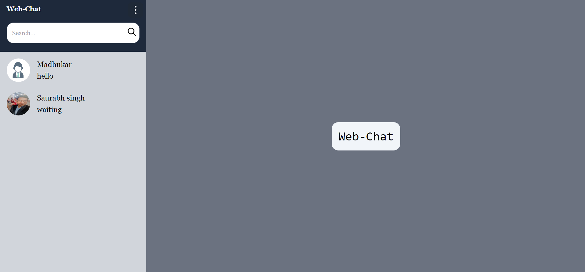
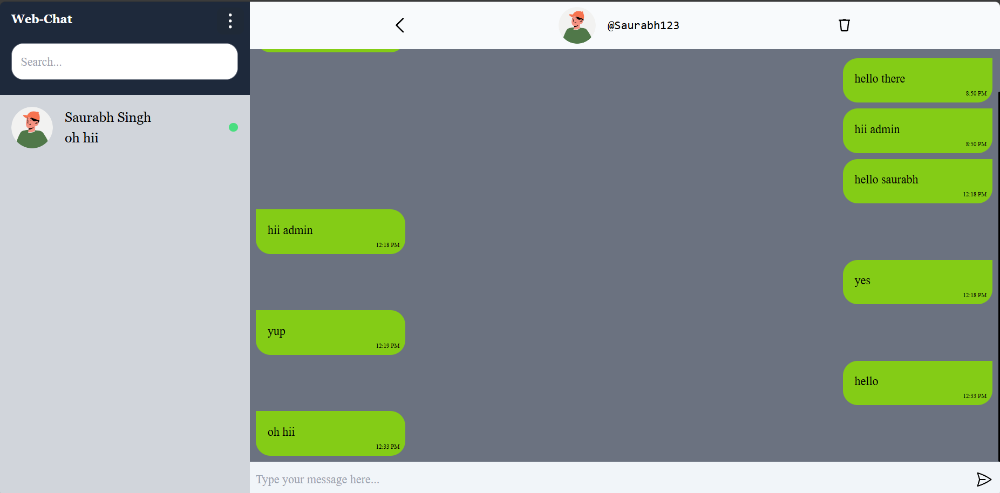
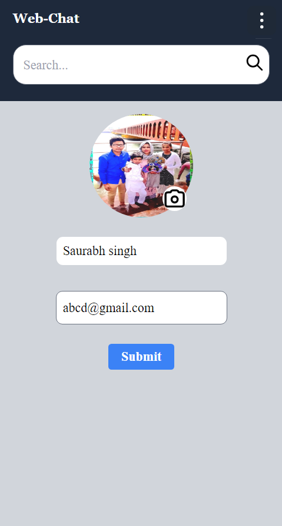
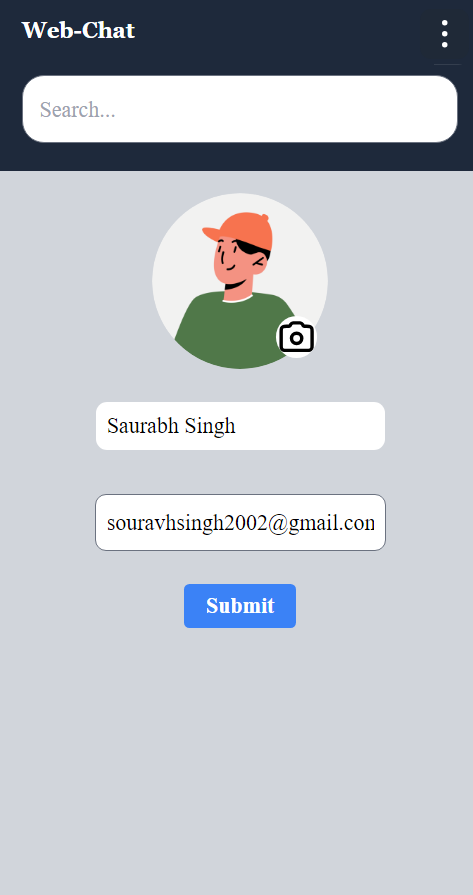

# 💬 ChatSphere

A full-stack real-time chat application built with the **MERN stack** (MongoDB, Express.js, React, Node.js) and **Socket.IO** for instant messaging. ChatSphere enables one-on-one conversations, group chats, and user profile management — all in real time.

## ✨ Features

### 💬 Real-Time Messaging
- **One-on-One Chat** — Send and receive messages instantly via WebSockets (Socket.IO)
- **Group Chat** — Create groups, add members, and chat in real time with multiple users
- **Online Status** — See which users are currently active with live presence indicators
- **Message Deletion** — Delete your own messages from any conversation

### 👤 User Management
- **Signup & Login** — Secure authentication with password hashing (bcrypt)
- **Profile Customization** — Upload and update your profile picture (stored via Cloudinary)
- **Password Reset** — OTP-based email verification flow to securely reset your password

### 🔧 Additional
- **Lazy Loading** — Messages load progressively as you scroll up for better performance
- **Search** — Filter conversations and groups by name
- **Responsive Design** — Fully usable on both desktop and mobile viewports
- **Toast Notifications** — Real-time feedback for new messages, errors, and actions

## 🖼️ Screenshots

### Home Screen


### Chat Screen


### Login / Signup


### Profile


## 🛠️ Tech Stack

| Layer      | Technology                          |
| ---------- | ----------------------------------- |
| Frontend   | React 18, Vite, Tailwind CSS       |
| Backend    | Node.js, Express.js                |
| Database   | MongoDB (Mongoose ODM)             |
| Real-time  | Socket.IO                          |
| Auth       | bcrypt, OTP email verification     |
| Media      | Cloudinary (profile image storage) |
| Email      | Nodemailer                         |

## 📁 Project Structure

```
ChatSphere/
├── Backend/
│   ├── Models/          # Mongoose schemas (User, Message, Conversation, Group)
│   ├── Routes/          # Express API routes (User, Conversation, Groups)
│   ├── Utils/           # OTP generation, email verification helpers
│   ├── Database.js      # MongoDB connection
│   └── index.js         # Express + Socket.IO server entry point
│
├── src/
│   ├── Components/
│   │   ├── Dashboard.jsx        # Main chat dashboard with sidebar & chat screen
│   │   ├── Login.jsx            # Login / Signup page
│   │   ├── Otp.jsx              # OTP verification page
│   │   ├── CreatePassword.jsx   # Password reset page
│   │   ├── Menu/                # Context menus & search user panel
│   │   └── UserSection/         # Chats, Groups, Profile views
│   ├── Contexts/
│   │   └── DashboardContext.jsx # Global state management (React Context)
│   ├── styles/
│   │   └── Login.module.css     # CSS Module for the login page
│   ├── App.jsx                  # Router configuration
│   └── main.jsx                 # Application entry point
│
├── index.html
├── package.json
├── tailwind.config.js
└── vite.config.js
```

## 🚀 Getting Started

### Prerequisites

- **Node.js** v18+
- **MongoDB** (local or MongoDB Atlas)
- **Cloudinary** account (for profile image storage)

### 1. Clone the repository

```bash
git clone https://github.com/Sourabh7singh/MernChatApp.git
cd MernChatApp
```

### 2. Setup Environment Variables

#### Frontend `.env`

```env
VITE_SERVER_URL=http://localhost:5000
```

> During production, replace with the hosted backend URL.

#### Backend `.env`

```env
PORT=5000
MongoUri=your_mongodb_connection_string
Cloud_name=your_cloudinary_cloud_name
Cloud_ApiKey=your_cloudinary_api_key
Cloud_ApiSecret=your_cloudinary_api_secret
```

> `MongoUri` can be a local MongoDB connection string or a MongoDB Atlas URI.
> Cloudinary credentials can be found in your [Cloudinary Dashboard](https://cloudinary.com/console).

### 3. Install Dependencies & Run

#### Backend

```bash
cd Backend
npm install
node index.js
```

#### Frontend

```bash
# From root directory
npm install
npm run dev
```

The app will be available at **http://localhost:5173**.

## 📡 API Endpoints

| Method | Endpoint                                    | Description                   |
| ------ | ------------------------------------------- | ----------------------------- |
| POST   | `/api/user/signup`                          | Register a new user           |
| POST   | `/api/user/login`                           | Login with credentials        |
| GET    | `/api/user/fetchUsers/:id`                  | Fetch all users except self   |
| GET    | `/api/user/fetchUser/:id`                   | Fetch single user details     |
| POST   | `/api/user/updateProfile`                   | Update profile picture        |
| GET    | `/api/user/resetpassword/:id`               | Initiate password reset (OTP) |
| POST   | `/api/user/verifyotp`                       | Verify OTP code               |
| POST   | `/api/user/:id/changepassword/:token`       | Change password with token    |
| POST   | `/api/conversation/sendMessage`             | Send a message                |
| POST   | `/api/conversation/fetchMessages`           | Fetch messages for a chat     |
| GET    | `/api/conversation/fetchConversations/:id`  | Fetch all conversations       |
| DELETE | `/api/conversation/deleteConversation/:id`  | Delete a conversation         |
| POST   | `/api/conversation/deleteMessage`           | Delete a specific message     |
| POST   | `/api/groups/createGroup`                   | Create a new group            |
| GET    | `/api/groups/getgroups/:id`                 | Fetch user's groups           |
| GET    | `/api/groups/getmessages/:id`               | Fetch group messages          |
| POST   | `/api/groups/sendmessage`                   | Send a group message          |
| DELETE | `/api/groups/deletegroup/:id/:userId`       | Delete a group (admin only)   |

## 🔌 WebSocket Events

| Event              | Direction       | Description                          |
| ------------------ | --------------- | ------------------------------------ |
| `addUser`          | Client → Server | Register user's socket connection    |
| `getUsers`         | Server → Client | Broadcast active users list          |
| `send-message`     | Client → Server | Send a direct message                |
| `getMessage`       | Server → Client | Receive a direct message             |
| `joinGroup`        | Client → Server | Join a group's socket room           |
| `sendGroupMessage` | Client → Server | Send a message to a group            |
| `getGroupMessage`  | Server → Client | Receive a group message              |

## 📄 License

This project is open source and available under the [MIT License](LICENSE).
