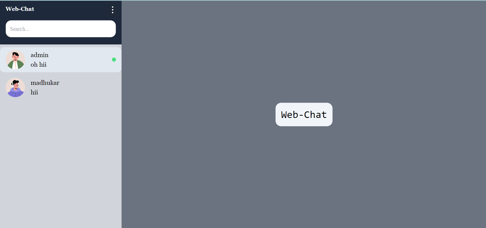
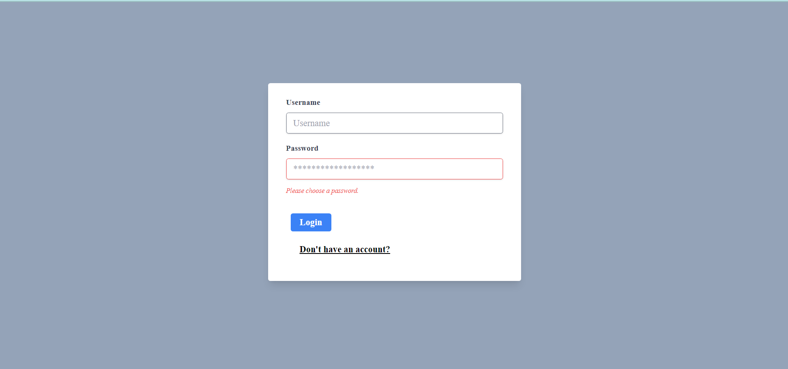
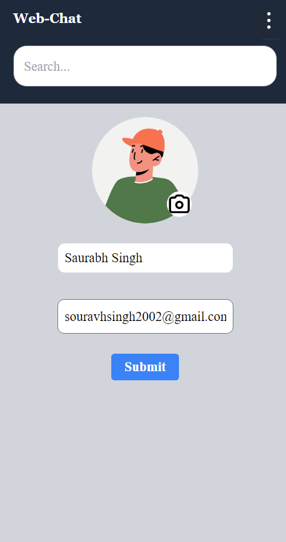

# Web Chat App
#### This app is built using Reactjs as frontend with vite bundler and nodejs + express as back end.
#### At the backend it uses clodinary for storing the images of the user.
# App
## Home Screen

## Chat Screen

## Signup/Login Page

## Profile Section

## Some Function of the application
<ul>
    <li>
        The user is able to chat with other user in realtime.
    </li>
    <li>
        The MongoDB stores the messages sent and received by the user.
    </li>
    <li>
        The User can freely change his/her profile image and name as well as email.
    </li>
        Every user is able to delete the messages sent by themselves only in any chat.
    <li>
        The user can create groups and chat in that group same like one to one chat it inludes realtime chatting and non-realtime storage of messages.
    </li>
    <li>
        The user who creates the group is admin of that group and has the authority to delete the group. 
    </li>
</ul>

# FrontEnd Env file structure
#### VITE_SERVER_URL = ....
#### during development the link can be the url of the backend server, during the production it needs the link of the server hosted.
# BackEnd Env file structure
#### PORT = ....
#### MongoUri = ....
#### Cloud_name= ....
#### Cloud_ApiKey = ....
#### Cloud_ApiSecret = ....
#### Mongouri is the mongodb connection key. It can either be localhost for mongodb compass connction string and can also be the mongodb atlas connection string.
#### The Cloud name,apikey and secret key can be found after creating an account on cloudinary website and using that for storing the images of the users in the cloudinary databse.
